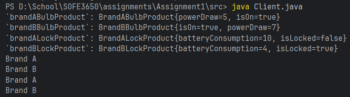

# SOFE 3650 - Software Design & Architecture: Assignment 1

## Group Information
**Group Number**: Group 37

| Student Name | Student ID | GitHub                                               | Contribution           |
| ------------ |------------|------------------------------------------------------|------------------------|
| Lily Redpath | 100862425  | [@redlils](https://github.com/redlils)               |  Java Code & README.md |
| Jonathan Leaper | 100924543 | [@JonathanLeaper](https://github.com/jonathanleaper) | UML Diagram            |

## Repository Layout
The repository layout is set up as the following:
```
Key:
<file/directory name> <(D)irectory/(F)ile> -> <description>
-------------------------------------------------------------
.idea (D)           -> IntelliJ Idea configuration folder
docs (D)            -> UML Diagram + any other documentation required
src (D)             -> All Java source files created for the project
.gitignore (F)      -> A standard .gitignore file
Assignment1.iml (F) -> The IntelliJ project file
README.md (F)       -> The file you're currently reading!
```

## Run information
This project was created using Java 21, but will most likely run using other versions

To run, either use an IDE such as IntelliJ or Eclipse and run the `Client` file, or use the following command;
```bash
cd src
java Client.java
```

## Example Output
